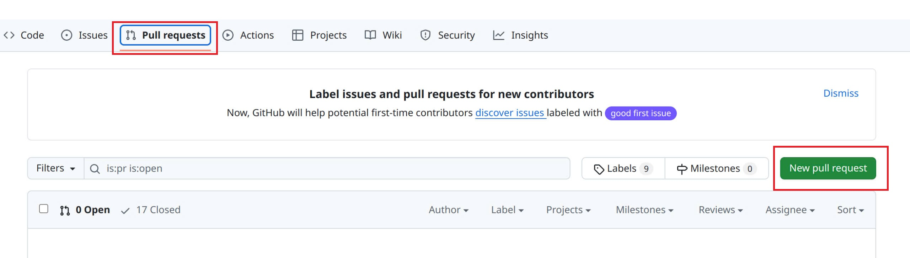
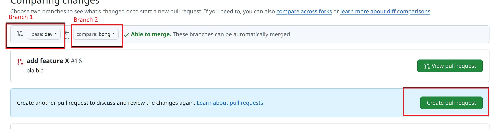

# Github

* Switch sang **dev** branch, và dùng `git pull` để kéo source mới nhất về.
* Từ dev branch dùng lệnh `git checkout -b <tên branch mới> dev`&#x20;
* Phát triển chức chức năng trên branch mà bạn vừa tạo.
* Sau khi hoàn thành dùng `git push` để đẩy lên.

<figure><figcaption></figcaption></figure>

* Sau khi đẩy lên thì cần phải tạo **Pull Request** để có thể merge vô dev.

<figure><figcaption></figcaption></figure>

* Trên màn hình **Pull Request**  cần chú ý.
  * Branch 1: là branch đích, bắt buộc phải là dev
  * Branch 2: là branch của bạn tạo ra muốn được merge vào dev
* Sau đó nhấn click Create pull request.
