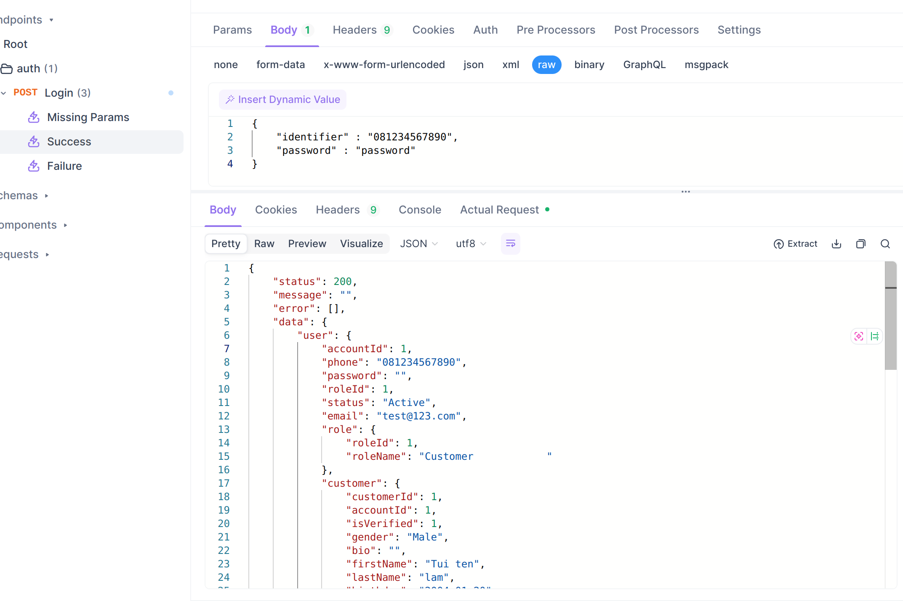

# API Dog

* Sau khi phát triển với BE thì cần define api của trên APIDOG.&#x20;
* Để làm gì ? Đề người làm việc cùng bạn có thể dễ dàng test, và định hình cách api bạn đã viết chạy như nào.
* Trên APIdog trước hết bạn phải tạo các endpoint tương ứng với API của bạn. Đồng thời phải lưu các res tương ứng status code mà bạn đã handle.
* Ví dụ: Mình có API logic thuộc auth cần trả về cho FE 3 case là Missing Params, Success, Failure.\
  Với mỗi case này trên BE sẽ phải trả về status code để BE có thể xử lí. Trong trường này, mình Missing Params -> status code trả về là 404, Success là 200.\
  Tùy thuộc vào hành vi và response mà status code có thể khác nhau, nên định nghĩa sao cho đúng ngữ nghĩa.\
  .png>)
* Và tương ứng với mỗi trường hợp bạn phải lưu response trả về.\
  \
